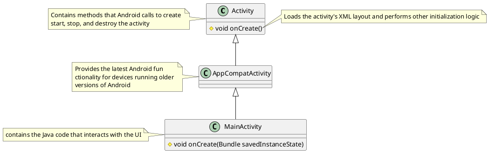

**Activity**: represents a single screen and handles interaction with the user. Every activity has an .xml file that defines the layout of its UI.
The UI is consisted of **Views** and **View Groups**:
- A view (also known as a widget) is a rectangular space that represents a UI element, like a text box, a radio button, a drop down list, etc.
- A view group organizes views together, and is usually used to give them a common id or how they appear next to each other (horizontally or vertically).
The following example demonstrates this hierarchy. Don't worry about having to memorize the attributes and values. You can just copy and paste them from documentation or other examples.
```html

<!-- This is a view group -->
<LinearLayout xmlns:android="http://schemas.android.com/apk/res/android"  
    xmlns:tools="http://schemas.android.com/tools"  
    android:id="@+id/activity_main"  
    android:layout_width="match_parent"  
    android:layout_height="match_parent"  
    android:orientation="vertical"  
    android:paddingBottom="16dp"  
    android:paddingLeft="16dp"  
    android:paddingRight="16dp"  
    android:paddingTop="16dp"  
    tools:context="com.example.pizzaparty.MainActivity">
    <!-- This is a view -->
	<TextView  
	    android:layout_width="wrap_content"  
	    android:layout_height="wrap_content"  
	    android:layout_marginTop="20dp"  
	    android:text="How hungry?"  
	    android:textSize="24sp"  
	    android:labelFor="@id/hungry_radio_group" />  

	<!-- This is a view group within a view group -->
	<RadioGroup  
	    android:id="@+id/hungry_radio_group"  
	    android:layout_width="fill_parent"  
	    android:layout_height="wrap_content"  
	    android:orientation="horizontal">  
	    <RadioButton        
		    android:id="@+id/light_radio_button"  
	        android:text="Light"  
	        android:layout_width="wrap_content"  
	        android:layout_height="wrap_content" />  
	    <RadioButton       
		    android:id="@+id/medium_radio_button"  
	        android:text="Medium"  
	        android:layout_width="wrap_content"  
	        android:layout_height="wrap_content"  
	        android:checked="true" />  
	    <RadioButton        
		    android:id="@+id/ravenous_radio_button"  
	        android:text="Ravenous"  
	        android:layout_width="wrap_content"  
	        android:layout_height="wrap_content" />  
	</RadioGroup>
</LinearLayout>
```


## Important Classes and Methods



`onCreate()` in `MainActivity` overrides the method in parent class. This function takes a `Bundle` object as argument, which saves the current state of the activity (including string values) so that if we need to recreate the activity, we wouldn't lose data. We need to call additional methods within `onCreate()` to initialize variables and load up the activity's content from the xml file:

```java
private RadioGroup mHowHungryRadioGroup;

@Override  
protected void onCreate(Bundle savedInstanceState) {  
    super.onCreate(savedInstanceState);
    // sets the activity's content to the given layout file.
	setContentView(R.layout.activity_main);
	// returns a View from the layout file that matches the given ID.
    mHowHungryRadioGroup = findViewById(R.id.hungry_radio_group);
}
```

### What the Heck is the `R` Class?
App resources (those located in the `res/` directory), including those of types drawables, layouts, strings, and colors, can be accessed via their **resource id**. The general syntax of these ids is as follows:
```java
// Format in Java
resource_type.resource_name
```
```html
<!-- Format in XML -->
@resource_type/resource_name
```
Example:
```java
layout.activity_main
```

Android Studio creates a hidden, Java `R` class. This classes contains subclasses for each resource type. Each subclass contains static integers that store the id for each specific resource.  Views are also resources and can be assigned ids in the XML code. These ids can be used in code like the following: 

```java
int slicesPerPerson = 0;  
int checkedId = mHowHungryRadioGroup.getCheckedRadioButtonId();  
if (checkedId == R.id.light_radio_button) {  
    slicesPerPerson = 2;  
}  
else if (checkedId == R.id.medium_radio_button) {  
    slicesPerPerson = 3;  
}  
else if (checkedId == R.id.ravenous_radio_button) {  
    slicesPerPerson = 4;  
}
```

## Resource Types
### Value
#### String
Instead of hard coding strings, we should save them as variables in `res/values/strings.xml` and import them using their ids and the following methods from the `Activity` class:
- `getString(resourceId)` returns a `String` for the given resource ID.
- `getText(resourceId)` returns a [[CharSequence in Java|`CharSequence`]] for the given resource ID that maintains HTML formatting.
Advantage of this is that we can format text using HTML tags.
To save a string:
```html
<resources>
	<string name="how_hungry"><i>How</i> <b>hungry</b>\?</string>
	<string name="question2">What\'s up\?</string>
	<string name="question3">"What's up?"</string>
</resources>
```
When not using double quotes, we have to escape special characters like `' " \ @`. `&` is represented by `&amp` and `<` as `&lt`.
#### Color
Similar to [[Android Developement#Strings|strings]], colors are defined can be defined as resources using the `<color>` tags:
```html
<color name="color_background">#152C</color>
```
Colors can have the following formats:
- `#RRGGBB` WTF is this?
- `#RGB` where each letter represents the potency of red, green, or blue using a hexadecimal number
- `#ARGB` where `A` represents transparency

Example of how to use colors and strings in `activity_main.xml`
```html
<LinearLayout ...
   android:background="@color/color_background">
   <TextView ...
      android:text="@string/question"
      android:textColor="@color/color_question" />
   <EditText ...
      android:text="@string/default_answer"
      android:textColor="@color/color_answer" />
</LinearLayout>
```

#### Dimension
Not included in the `res` folder by default. But we can create and use them to minimize having to hardcode sizes and keep a consistent UI.

Android devices can vary in their DPI (pixel density, or in other words, how many pixels there are per a unit of area). With that in mind, there are several units we can use when setting up dimension resources. `dp` and `sp` are abstract and can adapt to different devices with different DPI. These are good for keeping a consistent look. The rest are absolute.
- Abstract units:
	- `dp` based on the pixel density of the screen
	- `sp` based on the pixel density of the screen, but also depends on the users' font appearance
	- `px` a pixel
- Absolute units
	- `pt` $1/72$ of an inch
	- `mm` millimeter
	- `in` an inch

Access using `@dimen`:
```html
<Button  
    android:id="@+id/calc_button"  
    android:text="@string/button_text"  
    android:layout_width="match_parent"  
    android:layout_height="wrap_content"  
    <!-- @dimen -->
    android:layout_marginTop="@dimen/button_to_margin"  
    android:onClick="calculateClick" />
```

### Drawable


## Model-View-Controller Architecture
This android development architecture is about keeping the business logic and UI of the app separate. You have a controller `MainActivity.java` that acts as an intermediary between the a `.java` class that holds the logic of the app and an `.xml` file that holds the UI information.
![[embedded_image_1java_ba727bd4-e4b9-6ae5-a349-fcfaecdd06be_fkmPeagaJCnOoypdz5tn.png]]
Source: zyBooks

