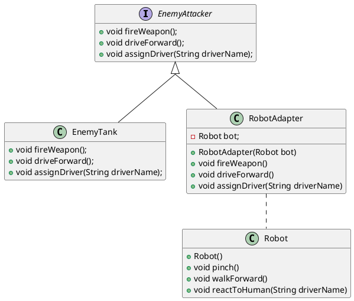

Allow incompatible interfaces to work together

# The Problem



Suppose we're developing a video game. We create an interface `EnemyAttacker` to group and organize all enemies in the game. 
```java
public interface EnemyAttacker {  
    public void fireWeapon();  
  
    public void driveForward();  
  
    public void assignDriver(String driverName);  
}


import java.util.Random;  

public class EnemyTank implements EnemyAttacker {  
    Random generator = new Random();  
    
    @Override  
    public void fireWeapon() {  
        int attackDmg = generator.nextInt(10) + 1;  
        System.out.println("Enemy tank fires and deals " + attackDmg + " damage!");  
    }  
    
    @Override  
    public void driveForward() {  
        System.out.println("Enemy tank moves " + generator.nextInt(5) + 1 + " spaces!");  
    }
    
    @Override  
    public void assignDriver(String driverName) {  
        System.out.println("Enemy tank is operated by " + driverName);  
    }  
}
```

One day, we find a free (but not open source) `Robot` class that we would like to add to our game. But this `Robot` class is not an `EnemyAttacker`: it works different, has different methods, and doesn't follow the `EnemyAttacker` interface. In other words, unless we make some major changes in our program, `Robot` is not compatible with the rest of the program. So we face a bit of an issue.

```java
public class Robot {  
    Random generator = new Random();  
  
    public void pinch() {  
        System.out.println("Enemy robot pinches with its grapples and deals " + (generator.nextInt(10) + 1) + " damage!");  
    }  
  
    public void walkForward() {  
        System.out.println("Enemy robot moves " + (generator.nextInt(5) + 1) + " spaces forward.");  
    }  
  
    public void reactToHuman(String driverName) {  
        System.out.println("Enemy robot takes orders from no human! Poor " + driverName + " is ran over.");  
    }  
}
```

# The Solution
We can create a `RobotAdapter` that allows us to treat `Robot` as an `EnemyAttacker`, making them compatible.

```java
public class RobotAdapter implements EnemyAttacker {
	Robot bot;

	public RobotAdapter() {
		bot = new Robot();
	}

    @Override  
    public void fireWeapon() {  
        bot.pinch();
    }  
    
    @Override  
    public void driveForward() {  
        bot.walkForward(); 
    }
    
    @Override  
    public void assignDriver(String driverName) {  
        bot.reactToHuman(driverName); 
    }  
}
```

```java
import java.util.ArrayList;  
import java.util.Collection;  
  
public class Client {  
    public static void main(String[] args) {  
        Collection<EnemyAttacker> enemies = new ArrayList<>();  
        enemies.add(new EnemyTank());  
        enemies.add(new RobotAdapter(new Robot()));  
  
        for (EnemyAttacker enemy : enemies) {  
            enemy.fireWeapon();  
            enemy.driveForward();  
            enemy.assignDriver("Peter");  
        }  
    }  
}
```
Output:
```
Enemy tank fires and deals 6 damage!
Enemy tank moves 5 spaces!
Enemy tank is operated by Peter
Enemy robot pinches with its grapples and deals 5 damage!
Enemy robot moves 2 spaces forward.
Enemy robot takes orders from no human! Poor Peter is ran over.
```
