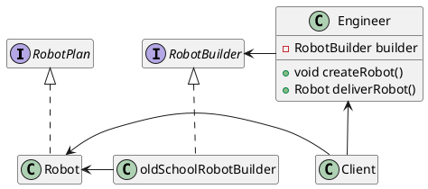

The scenario starts with the `Client` wanting a `Robot`.
`Client` uses the `Engineer` to get the `Robot`. The `Engineer` doesn't know how robots are created. It's an intermediary between the `Client` and another object that knows how to make robots–It uses a `RobotBuilder`. The `RobotBuilder` has (knows) a specific `RobotPlan` (robot blue print) and can make it using specific. 

