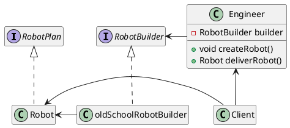

```plantuml
@startuml Builder Design Pattern

skinparam groupInheritance 2
hide empty members

Interface RobotPlan {

}

class Robot implements RobotPlan {

}

Interface RobotBuilder {

}

class oldSchoolRobotBuilder implements RobotBuilder {

}

class Engineer {
	- RobotBuilder builder
	+ void createRobot()
	+ Robot deliverRobot()

}

class Client {


}

Engineer <- Client
RobotBuilder <- Engineer 
Robot <- oldSchoolRobotBuilder
Robot <- Client
@enduml
```

The scenario starts with the `Client` wanting a `Robot`.
`Client` uses the `Engineer` to get the `Robot`. The `Engineer` doesn't know how robots are created. It's an intermediary between the `Client` and another object that knows how to make robots–It uses a `RobotBuilder`. The `RobotBuilder` has (knows) a specific `RobotPlan` (robot blue print) and can make it using specific. 


# Better explanation
<iframe width="560" height="315" src="https://www.youtube.com/embed/Wqx4N4tV_tc?si=RevJ07r4RFUMYH-p" title="YouTube video player" frameborder="0" allow="accelerometer; autoplay; clipboard-write; encrypted-media; gyroscope; picture-in-picture; web-share" referrerpolicy="strict-origin-when-cross-origin" allowfullscreen></iframe>

Imagine you walk into Subway restaurant to order a sandwich. Subway obviously has a lot of customizations available, with hundreds of different choices from breads, meats, cheese, sauces, toppings, etc..
How would we create a `Sandwich` object? We don't want to have a giant constructor with hundreds of optional parameters. That is called the *telescoping constructor anti-pattern*. 
Instead, we can implement the **builder design pattern**. 
To build a sandwich, we use a `SandwichBuilder` class. This class has a method for enabling each topping. The methods return the instance of the object, so we can chain them together. At the end, we call on a `Build()` method that creates a sandwich object based on the configurations the builder holds. 


```cs
public class Sandwich() 
{
	// Properties with no setter can only be set in the constructor
	public bool Cheese { get; } = false;
	public bool Lettuce { get; } = false;
	public bool Tomato { get; } = false;
	public bool Onions { get; } = false;
	public Sandwich(SandwichBuilder sandwichBuilder) 
	{
		this.Cheese = sandwichBuilder.Cheese;
		this.Lettuce = sandwichBuilder.Lettuce;
		this.Tomato = sandwichBuilder.Tomato;
		this.Ontions = sandwichBuilder.Onions;
	}
}

public class SandwichBuilder 
{
	// Properties with a private setter can only be set internally in the object
	public bool Cheese { get; private set; } = false;
	public bool Lettuce { get; private set; } = false;
	public bool Tomato { get; private set; } = false;
	public bool Onions { get; private set; } = false;
	...
	
	public SandwichBuilder addCheese() 
	{
		this.Cheese = true;
		return this;
	}
	public SandwichBuilder addLettuce() 
	{
		this.Lettuce = true;
		return this;
	}
	...
	public Sandwich build() {
		// return a sandwich builder based on the current configurations
		return new Sandwich(this);
	}
}

public static void Main(string[] args)
{
	Sandwich veganSandwich = new SandwichBuilder()
		.addCheese()
		.addTomato()
		.addOnions()
		.Build();
}
```
