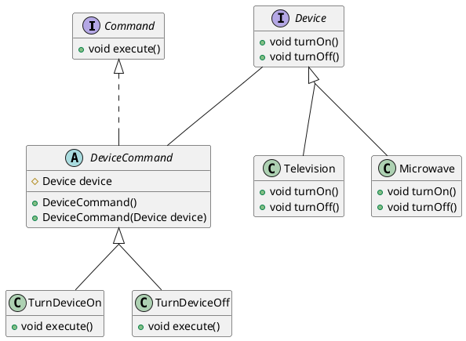

One downside to this design pattern is the number of small classes.



```java
class Client {
	public static void main(String[] args) {
		Device tv = new Television();
		new TurnDeviceOn(tv).execute();
	}
}
```

