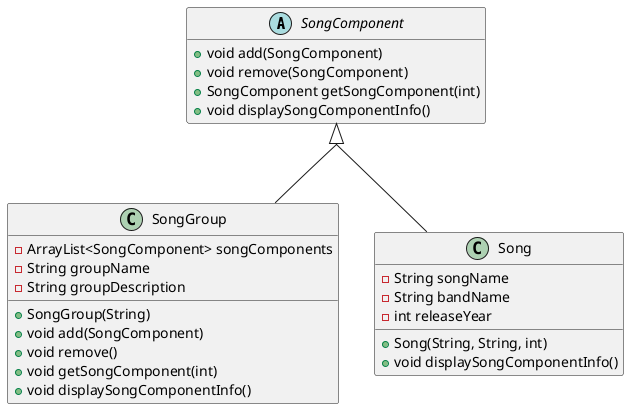

Allows an object to store itself as well as other similar types.
In the following example, `SongGroup` and `Song` both extend an abstract class `Songcomponent`.
`SongGroup` can store both `Song`s as well as other `SongGroup`s. Each of those `SongGroup`s can then store other `SongGroup`s and `Song`s, and so on.

An interesting part in the example used here (by [Derek Banas](https://youtu.be/2HUnoKyC9l0)) is that the methods in `SongComponent` don't have an implementation; they throw `UnsupportedOperationException`. Consider `SongComponent.add()`:
```java
public void add(SongComponent songComponent) {  
    throw new UnsupportedOperationException();  
}
```
`add()` is overriden in `SongGroup` to add objects of type `SongComponent` into an `ArrayList`. Thec`Song` class doesn't need such a method and therefore does not override it. So, if we call `Song.add()`, we're actually calling `SongComponent.add()` which will throw an `UnsupportedOperationException`. It is pretty neat.


