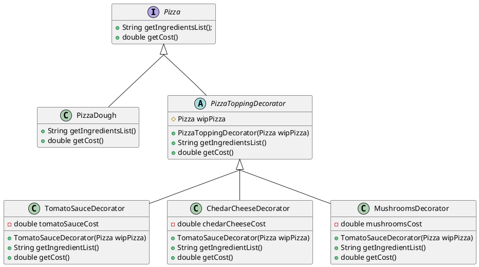

Dynamically add functionality to classes at runtime. Classes can also benefit from inheritance.

### The problem
Suppose we want to represent different pizza types in our system. One way would be to use inheritance:

```java
// We don't want to simply instantiate Pizza. We want to instantiate Pizza types. 
public abstract class Pizza {
	private String description;
	private double cost;
	// Abstract classes cannot be instantiated, but they can still have constructors.
	public Pizza(String description, String cost) {
		this.description = description;
		this.cost = cost;
	}
	public void setDescription(String description) {
		this.description = description;
	}
	public String getDescription() {
		return this.description;
	}
	public void setCost(double cost) {
		this.cost = cost;
	}
	public double getCost() {
		return this.cost;
	}
}
public class Wisconsin6CheesePizza extends Pizza {
	// Pre-defined values, however they can be changed via setters
		public Wisconsin6CheesePizza() {
		super("Tomato Sauce, Cheese, Cheddar Cheese, Feta Cheese, Shredded Parmesan, Shredded Provolone Cheese", 15.99);
	}
}
```

The `Wisconsin6CheesePizza` is only 1 of 12 specialty pizzas at Domino's. Let's assume we've created all 12 `Pizza` subclasses. 
Suppose there was a change in the price of tomato sauce. Then we would have to manually go into each subclass, calculate the new price for the pizza, and change the arguments in the constructors. That would be a tedious task at best, and impossible if there were more–a system could have thousands of such–subclasses.

### The Solution

```java
// All Pizzas must have these methods
public interface Pizza {
	public String getIngredientsList();
	public double getCost();
}
public class PizzaDough implements Pizza {
	@Override
	public String getIngredientsList() {
		return "Plain pizza dough";
	}
	@Override
	public double getCost() {
		return 4.0;
	}
}
public abstract class PizzaToppingDecorator implements Pizza {
	protected Pizza wipPizza;
	public PizzaToppingDecorator(Pizza wipPizza) {
		this.wipPizza = wipPizza;
	}
	@Override
	public String getIngredientsList() {
		return wipPizza.getIngredientDescription();
	}
	@Override
	public double getCost() {
		return wipPizza.getCost();
	}
}
public class TomatoSauceDecorator extends PizzaToppingDecorator {
	private double tomatoSauceCost = 0.35;
	public TomatoSauceDecorator(Pizza wipPizza) {
		super(wipPizza);
	}
	@Override
	public String getIngredientList() {
		return wipPizza.getIngredientList() + ", tomato sauce";
	}
	@Override
	public getCost() {
		return wipPizza.getCost() + tomatoSauceCost;
	}
}
public class ChedarCheeseDecorator extends PizzaToppingDecorator {
	private double chedarCheeseCost = 0.50;
	public TomatoSauceDecorator(Pizza wipPizza) {
		super(wipPizza);
	}
	@Override
	public String getIngredientList() {
		return wipPizza.getIngredientList() + ", chedar cheese";
	}
	@Override
	public getCost() {
		return wipPizza.getCost() + chedarCheeseCost;
	}
}
```




Using the Decorator pattern:
```java
public class PizzaMakerClient {
	public static void main(String[] args) {
		Pizza wisconsinCheesePizza = new TomatoSauceDecorator(new CheddarCheeseDecorator(new PizzaDough()));  
		System.out.println(wisconsinCheesePizza.getIngredientsList()); 
		System.out.println(wisconsinCheesePizza.getCost());  
    }  
}
```

A `PizzaDough` object is passed to instantiate a `CheddarCheeseDecorator` object, which is then passed to instantiate a `TomatoSauceDecorator` object. All these objects implement the `Pizza` interface, so we can refer to them all as `Pizza`.        

To get the total cost of a pizza, `wisconsinCheesePizza.getCost()` is calling `TomatoSauceDecorator.getCost()`, which is calling `CheddarCheeseDecorator.getCost()` and adding sauce cost to the result. `CheddarCheeseDecorator.getCost()` is calling `PizzaDough.getCost()` and adding cheese cost to its result. Finally, `PizzaDough.getCost()` just returns the cost of the dough. The return values are not stored in fields, but through chain calling, each call adds a cost, and passes it along to the next object.
