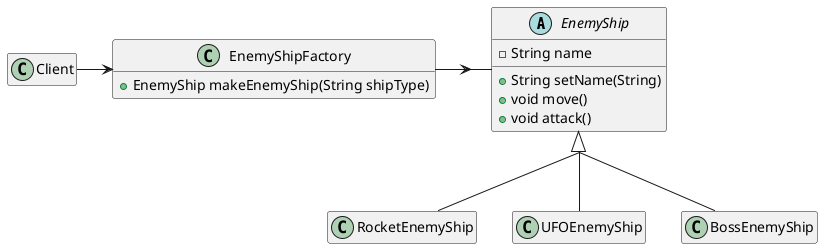

>When a method returns one of several possible classes that share a superclass

choosing classes at runtime without knowing ahead of time the exact type of the object
create object without specifying the exact class of the object

You make a class that is responsible for returning an object depending on the input

The factory returns an abstract class. In other words, `EnemyShipFactory` returns an object of type `EnemyShip`. The only methods you can call on such an object are those defined inside the `EnemyShip` abstract class like `move()` or `attack()`.



```java
public abstract class EnemyShip {
	private String name;
	public void setName(String name) {
		this.name = name;
	}
	public void move() {
		System.out.println(name + " moved");
	}
	public void attack() {
		System.out.println(name + " attacked");
	}
}

public class RocketEnemyShip extends EnemyShip {
	public RocketEnemyShip() {
		setName("Rocker")
	}
}

public class UFOEnemyShip extends EnemyShip {
	public UFOEnemyShip() {
		setName("UFO")
	}
}

public class BossEnemyShip extends EnemyShip {
	public BossEnemyShip() {
		setName("Boss")
	}
}

public class EnemyShipFactory {
	public static EnemyShip makeEnemyShip(String type) {
		return type.equals("r") ? new RocketEnemyShip : type.equals("u") ? new UFOEnemyShip : new BossEnemyShip();
	}
}

public class Client {
	public static void main(String[] args) {
		startGame(EnemyShipFactory.makeEnemyShip(new Scanner(System.in).nextLine().toLowerCase().substring(0, 1)));
	}

	public static void startGame(EnemyShip enemyShip) {
		enemyShip.move();
		enemyShip.attack();
	}
}

```


Another quick, succinct example of Factory Design Pattern with Tanks!
```java
public class Client2 {

	// For simplicity, we are declaring these classes inside our Client class, which has the main() method. Since main() is static, we can only reference static variables/methods inside it. So we must declare these inner classes as static.
    public static abstract class Tank {  
        private String name = this.getClass().getName();  
        public void move() {  
            System.out.println(name + " moved");  
        }  
        public void attack() {  
            System.out.println(name + " attacked");  
        }  
    }  
    public static class HeavyTank extends Tank {}  
    public static class MediumTank extends Tank {}  
    public static class LightTank extends Tank {}  
  
    public static class EnemyTankFactory {  
        public static Tank makeEnemyTank(String type) {  
            return type.equals("h") ? new HeavyTank() : type.equals("m") ? new MediumTank() : new LightTank();  
        /* Translation:
        if type.equals("h") is true
	        return new HeavyTank()
	    else
		    if type.equals("m") is true
			    return new MediumTank()
			else
				new LightTank()
        */
        }  
    }  
  
    public static void main(String[] args) {  
        System.out.println("Select enemy tank type (h/Heavy m/Medium. All other input selects Light)");  
        startGame(EnemyTankFactory.makeEnemyTank(new Scanner(System.in).nextLine().toLowerCase().substring(0, 1)));  
    }  
  
    public static void startGame(Tank enemyTank) {  
        enemyTank.move();  
        enemyTank.attack();  
    }  
}
```

