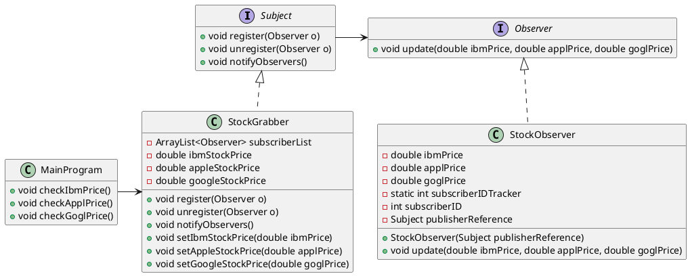

This design pattern is used to update many objects.
A _Subject_ (publisher) sends updates to the _Observers_ (subscribers).
One advantage of this pattern is loose coupling between the Subject and Observer, meaning the Subject does not need to know anything about the Observers. And, making changes in one class does not affect the other classes.



`MainProgram` is responsible for creating a publisher object (`StockGrabber`), managing the subscribers (`StockObserver`) and checking for changes in stock prices. The check price changes, `MainProgram` could connect to another program, a database, etc..

`StockGrabber` is the publisher. It keeps a list of the subscribers, can add, remove from the list, and  `update` them.
For example, the only way to make changes to `ibmStockPrice` is by calling the setter `setIbmStockPrice()`. And whenever there is a change, the subscribers should be notified, so `setIbmStockPrice()` also calls `notifyObservers()`. `notifyObservers()` would go through the list its subscribers and update each one.

Why do we need a `Subject` interface?

`StockObserver` represents the subscribers, and there could be many of them. There could be different classes, and as along as they implement the `Observer` interface, the publisher would send them updates. The subscribers could then choose to do whatever they want with the received  update (update implies pblisher sends data to subscribers).
There is a new feature in `StockObserver`: The constructor takes a reference of the publisher, and using that reference, automatically registers itself to the publisher.

```java
public interface Subject {  
    // interface methods are public and abstract by default  
    void register(Observer observer);  
  
    void unregister(Observer observer);  
  
    void notifyObservers();  
}


public class StockGrabber implements Subject {  
	private ArrayList<Observer> subscriberList;  
	private double ibmPrice;  
	private double applePrice;
	private double googlePrice; 
	 
    public StockGrabber() {  
        subscriberList = new ArrayList<>();  
    }
    
    @Override 
    public void register(Observer observer) {  
        subscriberList.add(observer);  
    }
    @Override  
    public void unregister(Observer observer) {
        subscriberList.remove(observer);  
    }  
    @Override  
    public void notifyObservers() {  
        for (Observer observer : subscriberList) {  
            observer.update(ibmPrice, applePrice, googlePrice);  
        }  
    }
    
    public void setIbmPrice(double ibmPrice) {  
        this.ibmPrice = ibmPrice;  
        // Whenever imbPrice changes, we notify all the subscribers of that change  
        this.notifyObservers();  
    } 
    public void setApplePrice(double applePrice) {  
        this.applePrice = applePrice;  
        this.notifyObservers();  
    }
    public void setGooglePrice(double googlePrice) {  
        this.googlePrice = googlePrice;  
        this.notifyObservers();  
    }


public interface Observer {  
    public void update(double ibmStockPrice, double appleStockPrice, double googleStockPrice);  
}


ublic class StockObserver implements Observer {  
    private double imbPrice;  
    private double applePrice;  
    private double googlePrice;  
	private static int subscriberIDTracker = 0;
	private int subscriberID;  
    private Subject publisherReference; 
     
    public StockObserver(Subject stockGrabber) {  
        this.publisherReference = stockGrabber;  
        // increment observerIDTracker first, then permanently save it locally in this object  
        this.subscriberID = ++subscriberIDTracker;  
        System.out.println("New Observer (ID: " + this.subscriberID + ") created.");  
        // subscriber registers itself into the publisher  
        this.publisherReference.register(this);  
    }  
  
    @Override  
    public void update(double ibmStockPrice, double appleStockPrice, double googleStockPrice) {  
        this.imbPrice = ibmStockPrice;  
        this.applePrice = appleStockPrice;  
        this.googlePrice = googleStockPrice;  
        subscriberReadsStockPrices();  
    }  
  
    public void subscriberReadsStockPrices() {  
        System.out.printf("Observer: %d\nIBM: %s\nApple: %s\nGoogle: %s\n\n", subscriberID, imbPrice, applePrice, googlePrice);  
    }  
}

public class MainProgram {  
    public static void main(String[] args) {  
        StockGrabber publisher = new StockGrabber();  
  
        StockObserver subscriber1 = new StockObserver(publisher);  
        publisher.setIbmPrice(147.05);  
        StockObserver subscriber2 = new StockObserver(publisher);  
        publisher.setApplePrice(142.16);  
        publisher.setGooglePrice(92.83);  
        publisher.unregister(subscriber2);  
        publisher.notifyObservers();  
    }  
}
```

