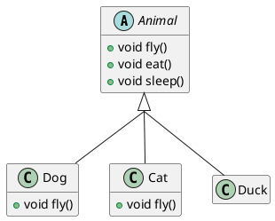
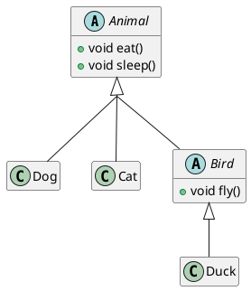
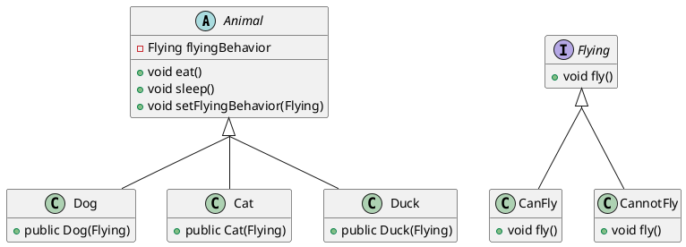

Store behavior as a variable. Change behavior during runtime.

This is terrible code design. Superclasses are meant to eliminate redundant code. Since `Cat` and `Dog` don't have the ability to fly, we would have to override the `fly()` method for them so they can't fly. Can you do that for a thousand other animal classes that don't fly?

Two principles to follow when designing software:
1. Eliminate redundant code.
2. Avoid coupling. Avoid techniques that make one class affect others. Change in a superclass should not break code in a subclass, and vice versa.

One solution would be refactoring common code into another intermediate class:

Another solution is to use the Strategy #designpattern.

We can create many different flying behaviors by creating classes that implement the `Flying` interface, like `CanFly` and `CannotFly` in the diagram above. Then, by having a field of type `Flying` in `Animal`, we use give any `Flying` behaviors to the animals without having to implement or override any methods--without having to make any changes to the subclasses. This idea connects to the avoid-coupling principle discussed above.

Using this pattern also allows us to change class behavior at run-time. That is, if at somepoint in run time we decide that a `Dog` object _can_ fly, we can change the flying behavior of that `Dog` using the `setFlyingBehavior()` method.