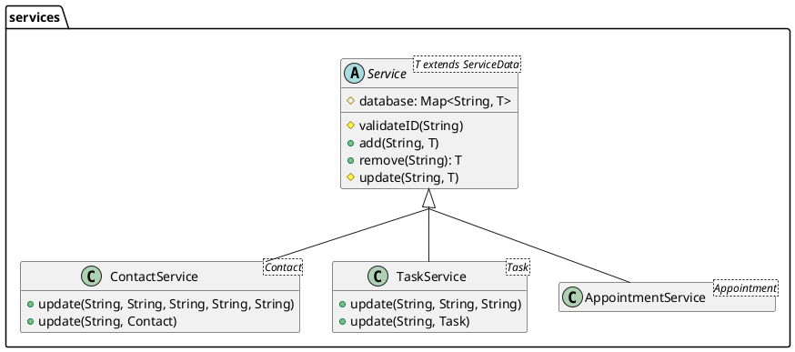

Standard template from [their website](https://plantuml.com/)
```plantuml
Bob -> Alice : hello 
Alice -> Wonderland: hello 
Wonderland -> next: hello 
next -> Last: hello 
Last -> next: hello 
next -> Wonderland : hello 
Wonderland -> Alice : hello 
Alice -> Bob: hello 
```


Used in SNHU CS 320 Project 1 Fall 2022 

